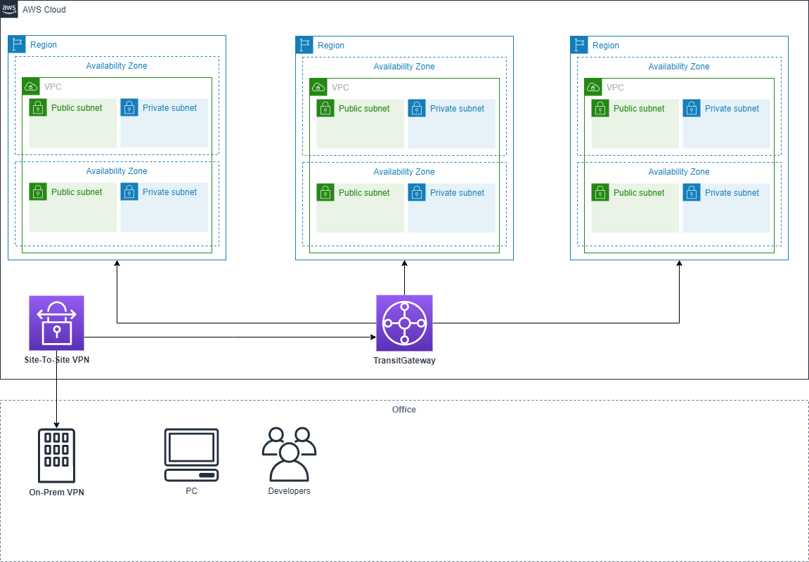

# terraform-tgw-vpn-vpc
An Example AWS TransitGateway accross VPCs in muti regions and VPN connection.



## AWS Credentials
Hard-coded credentials is not recommended, which could exposes risk point.

### Environment variables
```
$ export AWS_ACCESS_KEY_ID="anaccesskey"
$ export AWS_SECRET_ACCESS_KEY="asecretkey"
$ export AWS_DEFAULT_REGION="us-west-2"
```

## Usage
```
$ git clone https://github.com/odg0318/terraform-tgw-vpn-vpc.git
$ cd terraform-tgw-vpn-vpc/network
$ terraform init
$ terraform plan -var cgw_ip_address=x.x.x.x
```
## Input
| Name        | Description   | 
| ------------- |-------------|
|cgw_ip_address  | OnPrem VPN IP adress |

## Generated resources
* 1 Customer Gateway
* 1 Site To Site VPN Connection (ap-northeast-2)
* 1 ransit Gateway
* 3 Transit Gateway Attachments (2 VPCs, 1 VPN Connection)
* 2 VPCs (ap-northeast-2, us-east-1)

Each VPC has the following resources
* 2 Public subnets
* 2 Private subnets
* 2 Route tables
* 1 Internet Gateway
* 2 NAT Gateways
* 2 EIPs

## External resources
* https://registry.terraform.io/modules/terraform-aws-modules/vpc/aws/2.22.0
* https://www.terraform.io/docs/providers/aws/index.html
